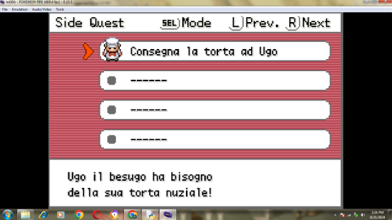

## To compile
It uses python and devkitarm, run the build2.py , if no message appears it means code compiled successfully and you will get a multi.gba
# BPRE-Sidequests
This is a sidequest menu made by Avon from italian forums , all credits to him.
It can store upto 128 quests , a flag for quest in progress and a flag when complete , has separate pages for completed quests and ongoing quests.
## Main Tutorial coming soon
## small guide
to switch between pages you need to disable Help system, it isn't compatible by CFRU, to make quests you need to look in debug_quests.c at include, follow the table there and define your quest name and description by using hex and gice quest flag complete and flag quest starts.

